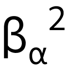
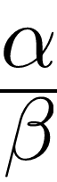
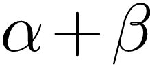
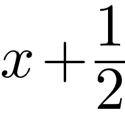
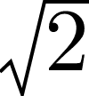
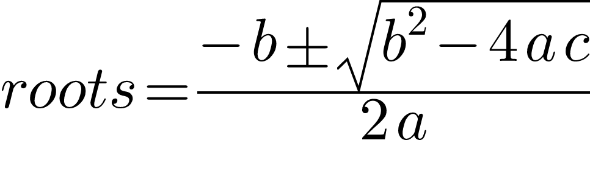

# MathML rendering

Exploratory implementation of MathML rendering using [linebender](https://github.com/linebender) ecosystem (in particular tiny_skia and parley).

No parsing of the XML format yet, and when it does, it will only deal with "presentation" MathML nodes (as opposed to "content" nodes).
From some testing, I think [Temml](https://github.com/ronkok/Temml)
only outputs presentation nodes, which could make this fit for the purpose of rendering LaTeX.

## Requirements
- "TexMaths Symbols" font installed

## Render examples:

White background on all texts helps check alignments. Open image in new tab can be clearer if you have dark mode in GitHub.

| LaTeX equivalent | rendered png |
| --- | --- |
| ${\beta_\alpha}^2$ |  |
| $\frac{\alpha}{\beta}$ |  |
| $\frac{\alpha_n}{2}$ |  |
| $\alpha + \beta$ |  |
| $x + \frac{1}{2}$ |  |
| $\sqrt{2}$ |  |
| quadratic roots |  |

## Presentation nodes preliminarily implemented:
- [x] `<mi>`
- [x] `<mn>`
- [x] `<msub>`
- [x] `<msup>`
- [x] `<mo>`
- [x] `<mfrac>`
- [x] `<mrow>`
- [x] `<mtext>`
- [ ] `<mspace>`
- [ ] `<ms>`
- [ ] `<msqrt>`
- [ ] `<mroot>`
- [ ] `<mstyle>`
- [ ] `<merror>`
- [ ] `<mpadded>`
- [ ] `<mphantom>`
- [ ] `<mfenced>`
- [ ] `<menclose>`
- [ ] `<msubsup>`
- [ ] `<munder>`
- [ ] `<mover>`
- [ ] `<munderover>`
- [ ] `<mmultiscripts>`
- [ ] `<mtable>`
- [ ] `<mtr>`
- [ ] `<mtd>`
- [ ] `<maligngroup>`
- [ ] `<malignmark>`
- [ ] `<mglyph>`
- [ ] `<mlongdiv>`

## Future subtleties to work in:
- stretching operators
- make text italic when it's meant to (identifier with one character)
- add an interface for renderers, and try make `vello` implement whatever trait is drawn up, and only load fonts once.

## And after that:
- xml parser, set up to testing with Temml, revisit if parts of the MathML standard ignored should stay ignored
- consider whether CSS is necessary, could potentially use [simplecss](https://github.com/linebender/simplecss)
- set up benchmarking/profiling, experiment with alternative approaches and whether it makes any difference (recursively returning necessary dimensions and callback to to render into a Pixmap at an arbitrary position instead of copying the contents of pixmaps at every level)
